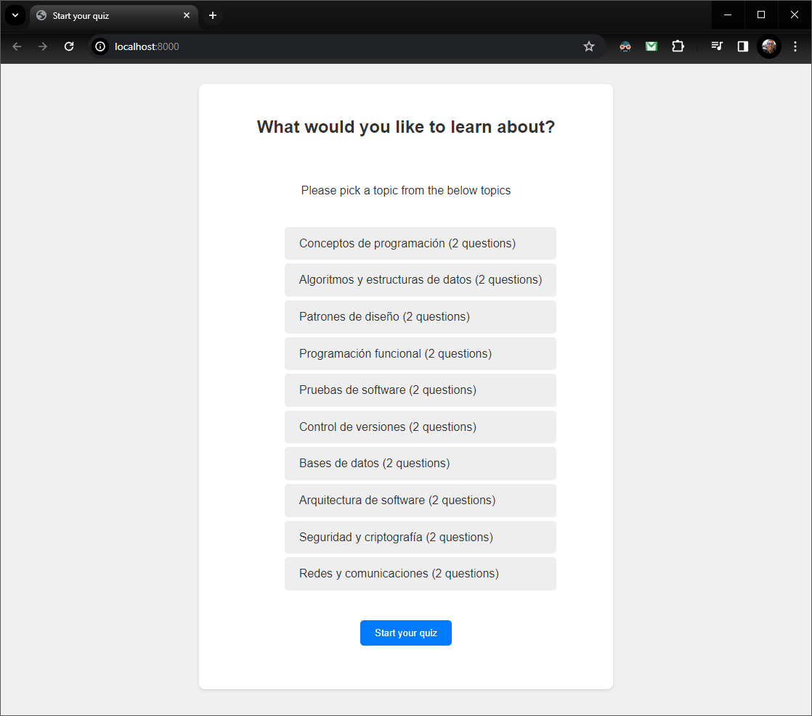
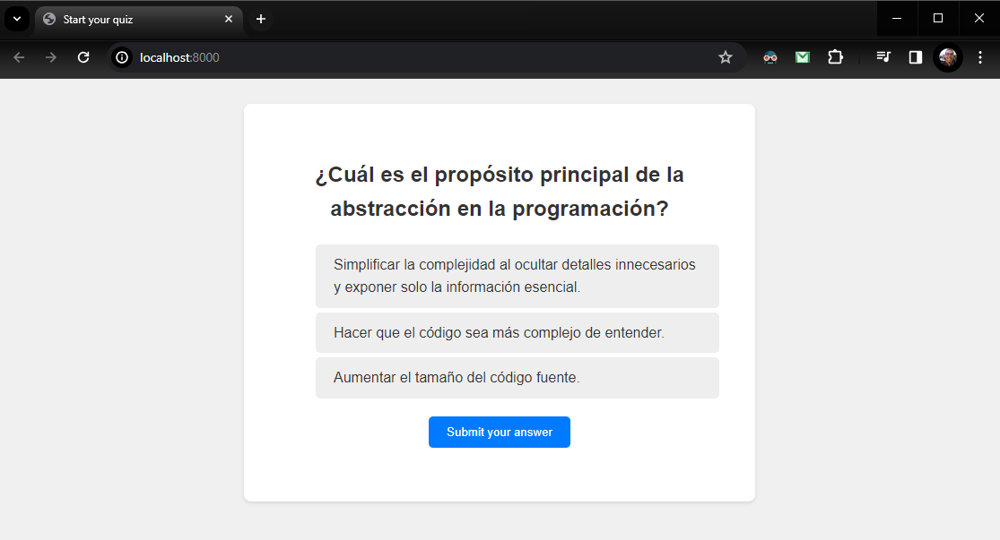
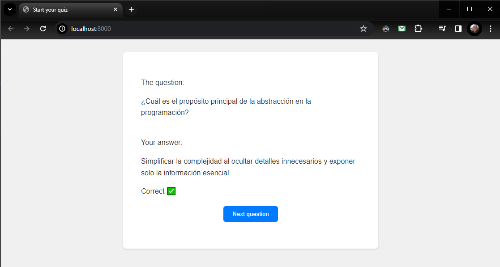
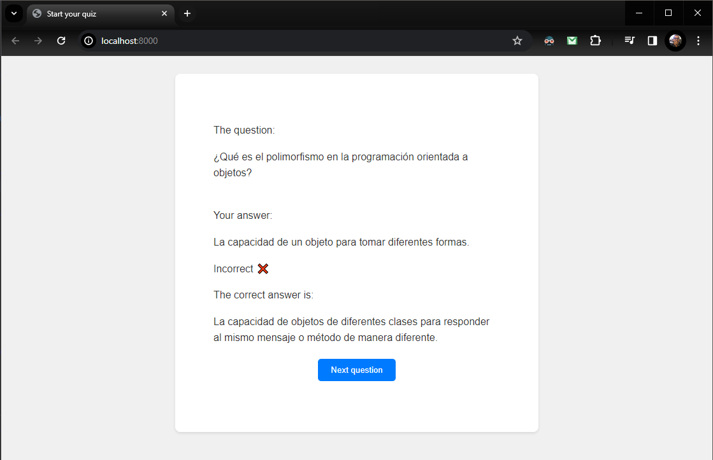
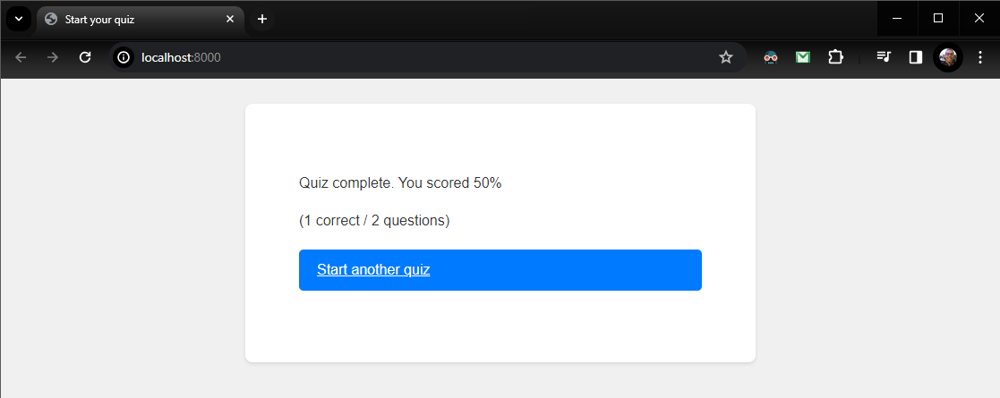

# Django-HTMX Quiz App

  
  
  
  
  

---

- Create environment (only first time)

  - py -m venv .venv

- Activate python environment

  - source .venv/Scripts/activate

- Install dependencies (only first time)

  - pip install -r requirements.txt

- Run app

  - python manage.py runserver

- Visit website
  - http://localhost:8000

---

- To load extra data, create a new yaml file following quiz_data.yaml format and execute:
  - python manage.py loaddata quiz_data.yaml
    - New quiz data must have different/consecutive pk's for quiz, question, answer to avoid conflict with existing ones.
